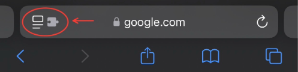

# Jut.su PWA App for Apple Devices

This **Userscript** adds Progressive Web App (PWA) features to the **Jut.su** website, transforming it into an app-like experience on **iOS** devices. The script provides full-screen mode, a custom home screen name, and more, making **Jut.su** feels like a native app when added to the iOS home screen.

## Features

- Adds **full-screen mode** to mimic an app experience.
- Custom **home screen name** ("Jut.su") when added to iOS home screen.
- **Hides the browser's address bar** to enhance the app-like feel when the page is loaded.

## How to Install the UserScript on iOS for Safari

### Requirements:
- **iOS device**
- **Safari browser**
- **UserScripts app** (Download from the App Store)

### Full Installation Guide:

#### 1. **Install the UserScripts App:**
   - Go to the **[UserScripts app on the App Store](https://apps.apple.com/us/app/userscripts/id1463298887)** and install it on your iOS device.

#### 2. **Configure UserScripts Extension in Safari:**
   - After installation, open **Safari** and go to **Tools**  
   - Click to **UserScripts** extension. After that a dialog box will appear, click **Always Allow** then **Always Allow on Every Website**.
   - You should now see a puzzle icon in the Safari toolbar when browsing.

#### 3. **Install the UserScript:**
   - Once **UserScripts** is installed and activated, open **Safari** and go to the following link to load the UserScript:  
     **[Jut.su PWA Feature UserScript](https://raw.githubusercontent.com/emp0ry/Jut.su-PWA-like-app-for-Apple/refs/heads/main/Jut.su_PWA_Feature.user.js)**
   - Click the **Puzzle (Tools)** button on the toolbar, then click on the **UserScripts** extension.
   - After the page loads, you'll see a message like "**UserScript Detected: Tap to install**".
   - Tap on the **Tap to Install** then click on to **Install** button to install the UserScript.
   - The script will be installed and activated automatically.

#### 4. **Verify Script Installation:**
   - Open **Safari** and navigate to the **[Jut.su](https://jut.su)** website.
   - Once the page loads, tap the **Share** button (the square with an arrow icon) at the bottom of the screen.
   - Tap **Add to Home Screen**.
   - You should see **Jut.su** as the app name. If name, not **Jut.su**, try refreshing the page or ensure the script is active by checking the **UserScripts** extension.
   - When the name is **Jut.su**, tap **Add** to install the site as a PWA-like app on your home screen.

#### 5. **Using Jut.su as a PWA-like App:**
   - After installation, you'll be able to open **Jut.su** from your home screen with a full-screen app-like experience, no browser UI, and the title **"Jut.su"** displayed as the app name.
   - The **address bar** will be hidden and it will behave similarly to a native app.

## License

This project is licensed under the MIT License - see the [LICENSE](LICENSE) file for details.
